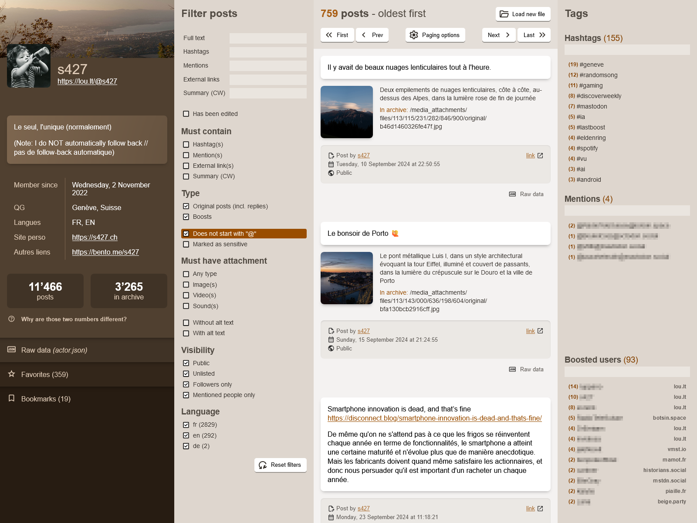

<!--
Ohart ongi: README hau automatikoki sortu da <https://github.com/YunoHost/apps/tree/master/tools/readme_generator>ri esker
EZ editatu eskuz.
-->

# MARL YunoHost-erako

[](https://ci-apps.yunohost.org/ci/apps/marl/)


[](https://install-app.yunohost.org/?app=marl)

*[Irakurri README hau beste hizkuntzatan.](./ALL_README.md)*

> *Pakete honek MARL YunoHost zerbitzari batean azkar eta zailtasunik gabe instalatzea ahalbidetzen dizu.*  
> *YunoHost ez baduzu, kontsultatu [gida](https://yunohost.org/install) nola instalatu ikasteko.*

## Aurreikuspena

Mastodon Archive Reader Lite (MARL) is a lightweight, single-page app that provides a user-friendly interface to explore the content of a Mastodon archive file: account data, posts, attachments, etc.

It runs in-browser and does not store any user data on the server (apart from the access log as per your YNH configuration).


**Paketatutako bertsioa:** 2.0~ynh1

**Demoa:** <https://s427.github.io/MARL>

## Pantaila-argazkiak



## Dokumentazioa eta baliabideak

- Erabiltzaileen dokumentazio ofiziala: <https://github.com/s427/MARL?tab=readme-ov-file#usage>
- Jatorrizko aplikazioaren kode-gordailua: <https://github.com/s427/MARL>
- YunoHost Denda: <https://apps.yunohost.org/app/marl>
- Eman errore baten berri: <https://github.com/YunoHost-Apps/marl_ynh/issues>

## Garatzaileentzako informazioa

Bidali `pull request`a [`testing` abarrera](https://github.com/YunoHost-Apps/marl_ynh/tree/testing).

`testing` abarra probatzeko, ondorengoa egin:

```bash
sudo yunohost app install https://github.com/YunoHost-Apps/marl_ynh/tree/testing --debug
edo
sudo yunohost app upgrade marl -u https://github.com/YunoHost-Apps/marl_ynh/tree/testing --debug
```

**Informazio gehiago aplikazioaren paketatzeari buruz:** <https://yunohost.org/packaging_apps>
