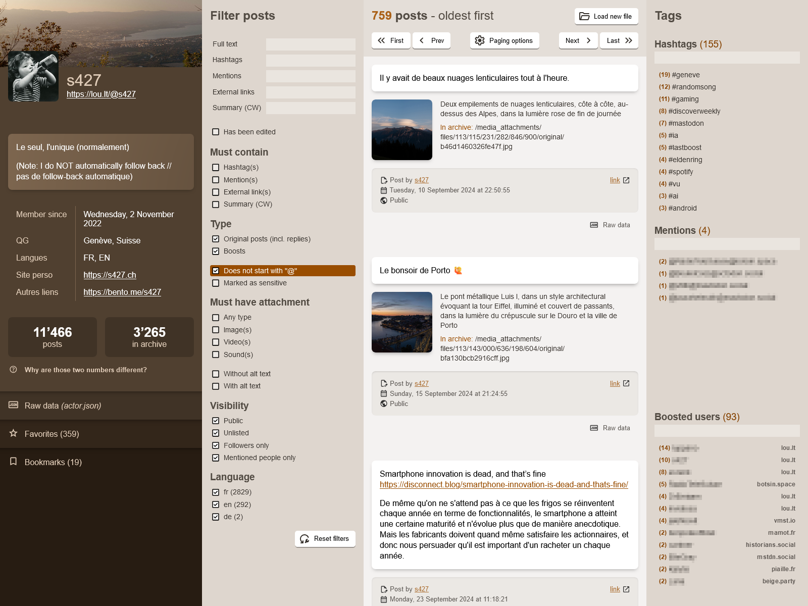

<!--
NOTA: Este README foi creado automáticamente por <https://github.com/YunoHost/apps/tree/master/tools/readme_generator>
NON debe editarse manualmente.
-->

# MARL para YunoHost

[](https://ci-apps.yunohost.org/ci/apps/marl/)


[](https://install-app.yunohost.org/?app=marl)

*[Le este README en outros idiomas.](./ALL_README.md)*

> *Este paquete permíteche instalar MARL de xeito rápido e doado nun servidor YunoHost.*  
> *Se non usas YunoHost, le a [documentación](https://yunohost.org/install) para saber como instalalo.*

## Vista xeral

Mastodon Archive Reader Lite (MARL) is a lightweight, single-page app that provides a user-friendly interface to explore the content of a Mastodon archive file: account data, posts, attachments, etc.

It runs by default in Local Mode, i.e. in-browser and does not store any user data on the server (apart from the access log as per your YNH configuration).
However you can also set it in Server Mode via the app configuration options, in order to display permanently one or several Mastodon archives stored online.


**Versión proporcionada:** 2.7~ynh1

**Demo:** <https://s427.github.io/MARL>

## Capturas de pantalla



## Documentación e recursos

- Documentación oficial para usuarias: <https://github.com/s427/MARL?tab=readme-ov-file#usage>
- Repositorio de orixe do código: <https://github.com/s427/MARL>
- Tenda YunoHost: <https://apps.yunohost.org/app/marl>
- Informar dun problema: <https://github.com/YunoHost-Apps/marl_ynh/issues>

## Info de desenvolvemento

Envía a túa colaboración á [rama `testing`](https://github.com/YunoHost-Apps/marl_ynh/tree/testing).

Para probar a rama `testing`, procede deste xeito:

```bash
sudo yunohost app install https://github.com/YunoHost-Apps/marl_ynh/tree/testing --debug
ou
sudo yunohost app upgrade marl -u https://github.com/YunoHost-Apps/marl_ynh/tree/testing --debug
```

**Máis info sobre o empaquetado da app:** <https://yunohost.org/packaging_apps>
